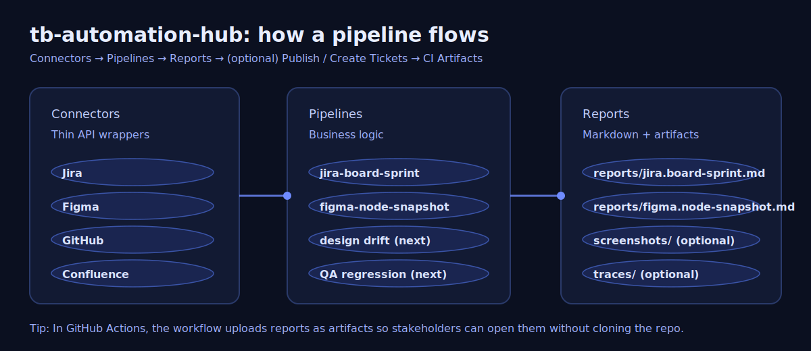
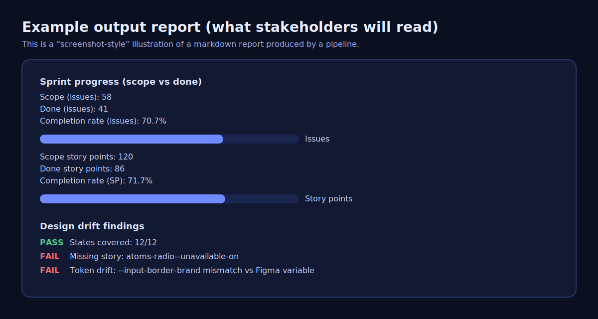

# tb-automation-hub

A lightweight “automation hub” repo that integrates **Jira**, **GitHub**, **Figma**, **Confluence**, and **QA automation** into repeatable pipelines.

This is intentionally framework-light: plain Node (ESM) scripts using `fetch`, env vars, and markdown report outputs.

## What this repo does (in one sentence)

Turns scattered manual workflows (pull data, compare, validate, summarize, publish) into **scheduled + on-demand pipelines** that output **auditable reports** and optionally **create/update tickets/pages**.



## Why this exists (problems it solves)

- **Too much manual effort**: teams repeatedly copy/paste metrics, screenshots, acceptance criteria, and status updates.
- **No single source of truth**: Jira, GitHub, Figma, and Confluence drift apart (states/ACs/tokens change).
- **Slow triage**: when something breaks, it’s hard to answer “what changed?”, “who owns it?”, “what evidence do we have?”
- **Inconsistent QA**: validation steps vary by person; results aren’t reproducible.

## Benefits

- **Repeatability**: the same inputs always produce the same reports and checks.
- **Traceability**: link “design → ticket → code → validation run” with evidence.
- **Faster debugging**: failures can include structured context (story IDs, screenshots, API payloads).
- **Less coordination tax**: auto-publish summaries to Confluence, and/or auto-create Jira follow-ups.
- **Safer releases**: turn “tribal knowledge” checks into automated gates.

## What you can build here

- **Jira metrics**: velocity, cycle time, SLA, blocked time, trend reports
- **Design drift detection**: Figma ↔ Storybook ↔ code tokens
- **QA automation**: regression packs (Playwright), accessibility checks, evidence bundles
- **Confluence publishing**: dashboards + report attachments
- **GitHub automation**: PR/Issue automation (comments, labels, issue creation)

## How it works (architecture)

- **Connectors** (`src/connectors/*`): small wrappers around each system’s API (Jira/GitHub/Figma/Confluence)
- **Pipelines** (`src/pipelines/*`): business logic for a workflow (pull → compute/diff → report)
- **Reports** (`src/report/*` + `reports/`): writes markdown output that CI can archive or publish
- **Runner** (`scripts/run-all.mjs`): runs one pipeline or all pipelines
- **CI** (`.github/workflows/automation.yml`): scheduled runs + manual “Run workflow” button; uploads `reports/` artifacts

## What’s included today (starter pipelines)

This repo is scaffolded with two starter pipelines so you can extend from a working baseline.
They already show the end-to-end pattern used by every automation here:

- Pull data from a system API (Jira/Figma/etc.)
- Compute a summary / diff
- Write a markdown report into `reports/`
- CI uploads `reports/` as an artifact

- **`jira-velocity`**: pulls issues using a JQL query and writes a simple “issue type breakdown” report  
  - Output: `reports/jira.velocity.md`
- **`design-drift`**: fetches a Figma file snapshot and writes a starter report (placeholder for deeper diffs)  
  - Output: `reports/figma.design-drift.md`

## What it does in practice (examples)



### Example 1: Weekly Jira “health + throughput” report (today: starter, next: full)

**Use case**: Every Monday you want an auto-generated summary: counts by issue type, plus (next iteration) cycle time and reopen rate. Instead of manually pulling Jira filters and writing status updates, the repo generates a report artifact you can link in Slack/Confluence.

Run locally:

```bash
node ./scripts/run-all.mjs --pipeline=jira-velocity
```

Inputs:
- `JIRA_BASE_URL`, `JIRA_EMAIL`, `JIRA_API_TOKEN`
- `JIRA_JQL` (optional; defaults to a simple “recently updated” query)

Example output (snippet from `reports/jira.velocity.md`):

```text
## Inputs
- JQL: "project = ELECOM AND updated >= -14d order by updated DESC"
- Max results: 50

## Issue type breakdown
| issue type | count |
|---|---:|
| Story | 18 |
| Bug | 9 |
| Task | 7 |
```

Benefits:
- You get a **consistent weekly report** with zero manual work.
- CI artifacts mean you always have **auditability**: “what did we report last week?”

### Example 2: Figma “design snapshot” (today) → design drift detection (next)

**Use case**: You want to know if a component’s states/variants in Figma changed (e.g., a new “Unavailable (on)” state added) so you can update Storybook/tests/tokens.

Run locally:

```bash
node ./scripts/run-all.mjs --pipeline=design-drift
```

Inputs:
- `FIGMA_TOKEN`
- `FIGMA_FILE_KEY`

Example output (snippet from `reports/figma.design-drift.md`):

```text
## Snapshot
- File name: "Kairos Design System"
- Top-level pages: 12
```

Benefits:
- A consistent baseline for drift detection (the next step is to map component node IDs and enumerate variants).

### Example 3: Scheduled automation (GitHub Actions)

**Use case**: You don’t want to remember to run scripts. CI runs it on a schedule and you can trigger it manually.

This repo includes a workflow at:
- `.github/workflows/automation.yml`

What you get:
- **Scheduled runs** (weekdays) produce fresh artifacts in Actions.
- **Manual “Run workflow”** for ad-hoc investigations.

### Example 4: Your RFW board (284) + your Figma node (62:31062)

You shared:
- Jira board: `https://tailored-prod.atlassian.net/jira/software/c/projects/RFW/boards/284`
- Figma node: `https://www.figma.com/design/w2YKWSK3SyzFGVr8dmcOe8/Component-Library?node-id=62-31062&m=dev`

This repo now includes pipelines that are ready to run with those targets:

Run the Jira active sprint summary for board 284:

```bash
node ./scripts/run-all.mjs --pipeline=jira-board-sprint
```

Run the Figma node snapshot:

```bash
node ./scripts/run-all.mjs --pipeline=figma-node-snapshot
```

Outputs:
- `reports/jira.board-sprint.md`
- `reports/figma.node-snapshot.md`

### Example 5: Design-to-delivery traceability graph (Figma → Jira → PR → Confluence)

This pipeline scans Jira issues and builds:
- A **matrix** of links (Jira issue → Figma links → PR links → Confluence links)
- A **Mermaid graph** showing relationships
- An **orphans list**:
  - tickets without design links
  - tickets without PR links
  - tickets without Confluence links

Run:

```bash
node ./scripts/run-all.mjs --pipeline=traceability-graph
```

Output:
- `reports/traceability.graph.md`

Notes:
- It detects links by parsing Jira summary/description for URLs.
- To enrich PR titles/states, set `GITHUB_TOKEN`.
- To enrich Confluence page titles, set `CONFLUENCE_*` creds.

## Typical expansions (recommended)

- **Jira ↔ GitHub**: auto-transition Jira tickets when PRs merge; enforce ticket links in PRs.
- **Figma ↔ Storybook**: list expected variant/state coverage from Figma and compare to Storybook stories.
- **Confluence dashboards**: publish the markdown reports into a living page (weekly exec summary, QA dashboard).
- **QA regression**: run Playwright against deployed Storybook/apps and attach screenshots/traces to Jira bugs.

## What you *do not* get yet (so expectations are clear)

This repo is a **foundation** with working connectors + starter pipelines. These are not implemented yet:
- Automatic Confluence publishing of markdown as a page (needs markdown→Confluence storage conversion strategy)
- Full “velocity” math (baseline vs post-change), sprint board querying, AI labels like `AI1/AI2` (like [`jira-velocity-metrics`](https://github.com/TMW-SP380/jira-velocity-metrics))
- Full design drift comparisons (Figma variants → Storybook story coverage → CSS/token checks)
- QA runs (Playwright) and auto-creating Jira bugs with screenshots/traces

If you want, I can implement the next concrete step so the repo feels immediately useful:
- **Jira sprint-board velocity report (like `jira-velocity-metrics`)**, but output markdown first (and optional PPT later)
- **Confluence publish step** that appends the markdown report to a specific page

## Setup

Copy `config/example.env` to `.env` and fill credentials.

```bash
cp config/example.env .env
```

### Credentials model (recommended)

- **Local runs**: use `.env` (never commit it)
- **GitHub Actions**: set secrets in repo settings (Jira/Figma/Confluence tokens, optional GitHub token)

## Run

Run all pipelines:

```bash
node ./scripts/run-all.mjs
```

Run a single pipeline:

```bash
node ./scripts/run-all.mjs --pipeline=jira-velocity
```

## Reports

Reports are written to `reports/` (markdown). CI uploads them as artifacts.

If a pipeline fails, the workflow still uploads any partial reports to help debugging.

## What “good” looks like (operating model)

- **Daily/weekly scheduled runs** keep dashboards fresh.
- **Manual runs** support ad-hoc audits (e.g., “what drifted after yesterday’s release?”).
- **Artifacts are evidence**: reports/screenshots/traces become your reproducible QA record.


